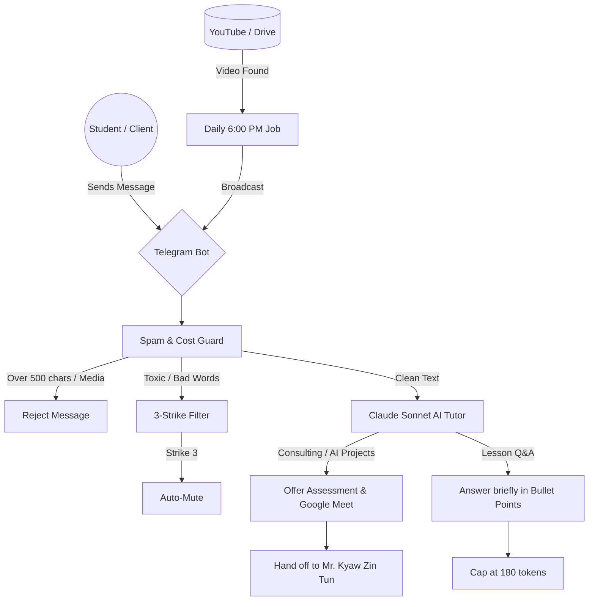

# AI Training Telegram Bot - High-End Learning Platform 🤖🧠

A fully autonomous, premium Telegram Bot that serves as a **Master AI Tutor**. It delivers progressive training lessons from YouTube and provides cost-effective, personalized AI tutoring using Anthropic's Claude API.

## 🚀 System Architecture & Flow



### 1. Registration (Zero-Friction)
- **No Google Forms needed.** 
- The moment a user searches the bot and sends `/start` or any text message, they are **automatically registered** and added to the `data/users.json` database.

### 2. Zero-Touch Automated Delivery (Set-and-Forget)
- **Schedule:** Triggers hourly in the background on **Monday, Tuesday, Wednesday, and Thursday**.
- **Weekend Sleep:** The automation safely pauses on **Friday, Saturday, and Sunday** to give students a break. No videos will auto-send on weekends.
- **Full Pipeline Logic:** 
  1. The bot scans the connected **Google Drive folder**.
  2. It automatically identifies the *oldest unsent* video (e.g. Lesson 2).
  3. It downloads the video and securely uploads it to YouTube as **Unlisted**.
  4. Once uploaded, it permanently logs the video ID to prevent duplicates and instantly broadcasts the inline YouTube link to all registered students.
- **No Queueing Needed:** The bot requires absolute zero human effort. Uploading to Drive is the *only* step the instructor does.

### 3. Master AI Tutor (Claude Sonnet)
- **Course Awareness:** The bot caches the entire Google Drive catalog in its system prompt but is strictly instructed **not to spam** the curriculum unless explicitly asked.
- **Founder Authority:** It recognizes the founder as **Mr. Kyaw Zin Tun**. If a student demands human support, it provides the official contact details:
  - Email: `itsolutions.mm@gmail.com`
  - Phone/WhatsApp: `+66949567820`
  - Viber: `+9595043252`

---

## 🛡️ Security & Reputation Guards

The bot acts as an impenetrable shield for both API costs and brand reputation:

1. **Media & Link Guard:** Students are physically blocked from sending links (`http`), videos, photos, or documents. (Only the Admin is immune to this rule).
2. **Text Length Armor (Cost Guard):** Student messages cannot exceed **500 characters** (approx. 80 words). Massive walls of text are instantly rejected to protect the Anthropic API bill.
3. **Sentiment / Toxicity Filter (3-Strike System):**
   - Strike 1 & 2: Issues a professional warning to keep messages respectful.
   - Strike 3: The user is automatically muted and locked out of the platform until the Admin intervenes.
4. **Strict Token Limits:** The AI is hard-capped at 180 output tokens and a memory depth of 6 messages (3 interactions). This guarantees API costs remain extremely low (approx. $0.003 per question).

---

## 🛠️ Admin Commands

The platform is managed completely inside Telegram by the Admin (defined in `.env`).

* `/users` — List all registered students and their status.
* `/unmute <id>` — Restore access to a student who received 3 strikes.
* `/broadcast <msg>` — Send an instant text announcement to all students.
* `/uploadvideo` — Emergency Bypass. Forces the bot to immediately download the next unsent video from Drive, upload to YouTube, and broadcast it to students, bypassing the weekend sleep mode.

## 💻 Technical Setup

**To start the bot permanently on macOS:**
```bash
bash start_bot.sh --install
```
*The bot runs as a background Launch Agent and will auto-restart if the Mac reboots.*

**To view logs:**
```bash
tail -f logs/bot.log
```
